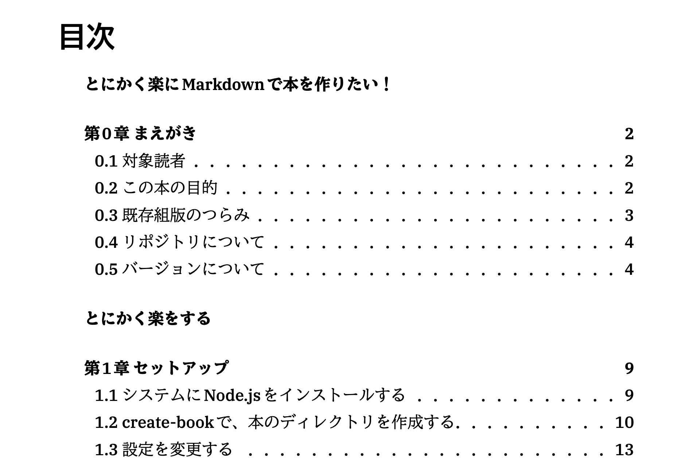

# 目次を制する

Vivliostyleではまっとうな自動作成の目次を出すのも少し苦労するが、この章ではそれらに関するノウハウをお伝えしよう。

## 結論から

`vivliostyle.config.js` に以下の設定を追加しましょう。

```js:vivliostyle.config.js
  //目次
  toc: true, // 目次を出す
  tocTitle: "目次", // 目次の項目名
  sectionDepth: 3, // 目次に出すセクションの深さ
```

つぎに目次の生成位置を制御します。

```js:vivliostyle.config.js
  entry: [
    // 表紙
    // { rel: "cover" },
    // 前書き
    "00-preface.md",
    // 目次
    { rel: "contents" },
    // 本文
    "chap-erukiti.md",
    // 後書き
    "99-postscript.md"
  ],
```

`vivliostyle.config.js`では`entry`で、原稿のファイルを指定します。通常はファイル名を指定しますが、目次の挿入位置には `{ rel: "contents" }` を入れましょう。

## 基本

設定ファイル `vivliostyle.config.js` で目次を設定してみよう。

まず `toc: true` を追加すると目次が自動生成されるようになります。ただし、この時点で生成される目次は、目次の見出しが `Table of Contents` になっています。そこで目次の見出しを変更しましょう。 `tocTitle: "目次"` です。

次に、セクションのどの深さまでを目次に出すか？の設定があります。`sectionDepth: 3`　のように設定しましょう。

<div class="column">
<div class="column-title">ToCの謎を追った</div>
　目次の自動生成はRe:VIEWから慣れている僕としてはかなり困惑するものでした。



さて、これを見ると分かるとおり、まえがきが「第0章」になってしまいます。また、entryで追加されたファイルはすべて問答無用で目次に追加されます。ダミーページなども入ってしまうため、様々な意味で困りものです。そのため、そういった細かい調整はどうやればいいのか？と目次自動生成の仕組みを追いかけました。

最初は、Re:VIEWのようなイメージだったので、Vivliostyle本体にあるのでは？と思ってた数時間粘ってたんですが、どうやらないらしい。どうしようもなくなって目次の生成物を見てみると少し特徴的なマークアップがされてたのでそれを手がかりに探っていくと、vivliostyle-cliに実装されてるようだ、というのが分かりました。

</div>

<div class="column">
<div class="column-title">最終的にどう対応したのか</div>
　本来であれば、原稿に定義したclassを見て、章の番号を非表示にする制御を入れたかったです。しかし、vivliostyle-cliに含まれる処理を弄りたくなかったのでCSSだけで完結する方法を考えたところ以下のような解決策にたどり着きました。

```css
:is(#toc, [role='doc-toc']) li > a[href^="chap"]::before {
  content: "第" target-counter(attr(href), vs-counter-chapter) "章";
  margin-right: 1em;
}
```

ここで注目するのは`a[href^="chap"]`という部分です。これは`chap`から始まるaタグを示すCSSセレクタです。つまり、`chap`から始まる原稿ファイルへのリンクであれば、章番号を表示するというCSSになっています。  
原稿を作るときにファイル名を気にする必要があるので、最適な解決策とはいえません。しかし、きれいな目次になったので今回はこの方法を採用しています。
</div>

